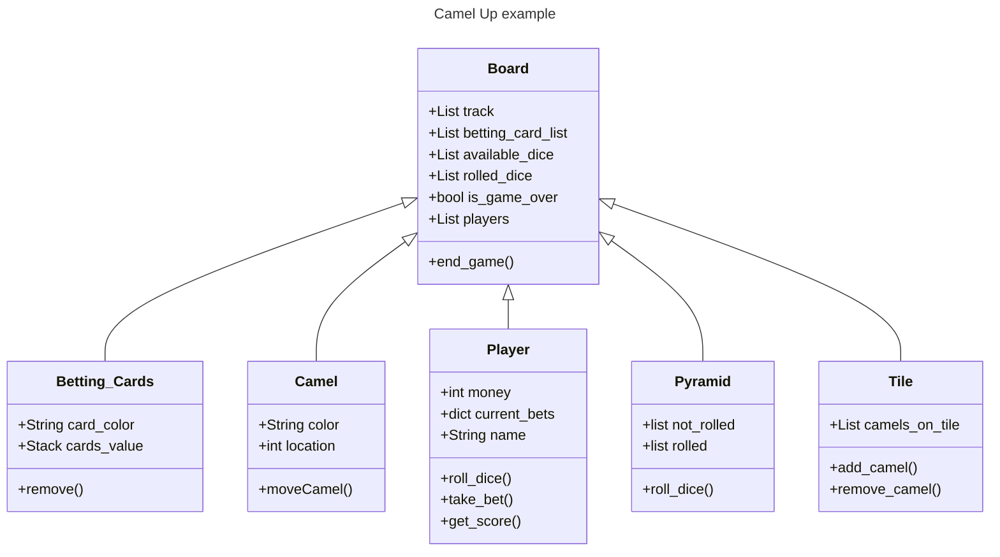

# C-AMP-el UP

## A console-based version of the Camel Up board game

```mermaid
---
title: Camel Up example
---
classDiagram
    Board <|-- Betting_Cards
    Board <|-- Camel
    Board <|-- Player
    Board <|-- Pyramid
    Board <|-- Tile
        
    class Betting_Cards{
        +String card_color
        +Stack cards_value 
        +remove()
    }

    class Camel {
        +String color
        +int location
        +moveCamel()
    }
       
    class Player {
        +int money
        +dict current_bets
        +String name
        +roll_dice()
        +take_bet()
        +get_score()
    }

    class Board {
        +List track
        +List betting_card_list 
        +List available_dice
        +List rolled_dice
        +bool is_game_over
        +List players
        +end_game()
    }

    class Pyramid {
        +list not_rolled 
        +list rolled
        +roll_dice()
    }

    class Tile {
        +List camels_on_tile
        +add_camel()
        +remove_camel()
    }      
```